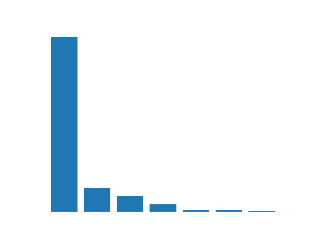
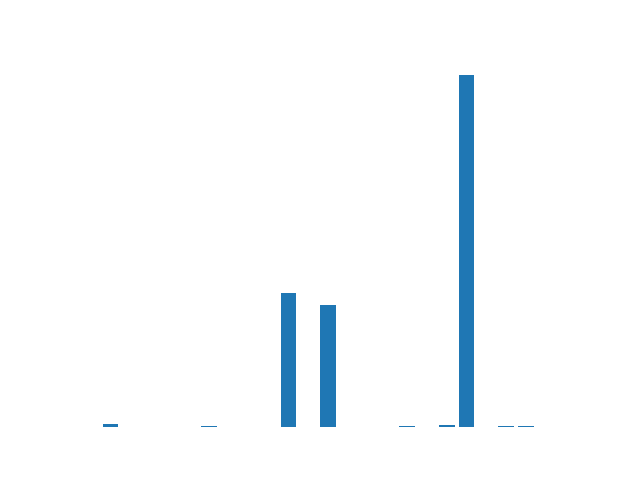

## KEEL Datasets

Most of the datasets were extracted from KEEL repository. Some of them present rows with missing values (which is the data present at the column missing), All datasets are in .arff format and separated in 20 files, a train and test set for each one of the iterations of a 10-fold stratified cross validation.

|name | instances | attributes | categorical | numeric | classes | missing | class distribution |
| -----: |  -----: |  -----: |  -----: |  -----: |  -----: |  -----: |  -----: |
|abalone | 4174 | 9 | 1 | 8 | 28 | 0.0 |  |
|adult | 48842 | 15 | 6 | 9 | 2 | 0.0 |  |
|appendicitis | 106 | 8 | 1 | 7 | 2 | 0.0 |  |
|artificialcharacters | 10218 | 8 | 1 | 7 | 10 | 0.0 |  |
|australian | 690 | 15 | 6 | 9 | 2 | 0.0 |  |
|balance | 625 | 5 | 1 | 4 | 3 | 0.0 |  |
|balancescale | 625 | 5 | 1 | 4 | 3 | 0.0 |  |
|banana | 5300 | 3 | 1 | 2 | 2 | 0.0 |  |
|banknotes | 1372 | 5 | 1 | 4 | 2 | 0.0 |  |
|bloodtransfusion | 748 | 5 | 1 | 4 | 2 | 0.0 |  |
|breast | 286 | 10 | 5 | 5 | 2 | 0.0 |  |
|bupa | 345 | 7 | 1 | 6 | 2 | 0.0 |  |
|car | 1728 | 7 | 7 | 0 | 4 | 0.0 |  |
|cargofreight | 3943 | 93 | 2 | 91 | 4 | 1.0 |  |
|chess | 3196 | 37 | 36 | 1 | 2 | 0.0 |  |
|chorals | 5665 | 15 | 13 | 2 | 102 | 0.0 |  |
|cleveland | 303 | 14 | 1 | 13 | 5 | 0.02 |  |
|coil2000 | 9822 | 86 | 1 | 85 | 2 | 0.0 |  |
|collins | 1000 | 20 | 0 | 20 | 30 | 0.0 |  |
|connect-4 | 67557 | 43 | 43 | 0 | 3 | 0.0 |  |
|contraceptive | 1473 | 10 | 1 | 9 | 3 | 0.0 |  |
|creditapproval | 690 | 16 | 7 | 9 | 2 | 0.03 |  |
|crx | 690 | 16 | 6 | 10 | 2 | 0.03 |  |
|dermatology | 366 | 35 | 1 | 34 | 6 | 0.02 |  |
|diabetic | 1151 | 20 | 3 | 17 | 2 | 0.0 |  |
|drugconsumption | 1885 | 31 | 12 | 19 | 7 | 0.0 |  |
|dummygerman | 1800 | 21 | 14 | 7 | 2 | 0.0 |  |
|ecoli | 336 | 8 | 0 | 8 | 8 | 0.0 |  |
|electricity | 45312 | 9 | 2 | 7 | 2 | 0.0 |  |
|fars | 100968 | 30 | 15 | 15 | 8 | 0.0 |  |
|flare | 1066 | 12 | 8 | 4 | 6 | 0.0 |  |
|frogs | 7195 | 23 | 1 | 22 | 4 | 0.0 |  |
|german | 1000 | 21 | 14 | 7 | 2 | 0.0 |  |
|ginaagnostic | 3468 | 971 | 1 | 970 | 2 | 0.0 |  |
|glass | 214 | 10 | 1 | 9 | 6 | 0.0 |  |
|haberman | 306 | 4 | 1 | 3 | 2 | 0.0 |  |
|hayes-roth | 160 | 5 | 1 | 4 | 3 | 0.0 |  |
|hcvegypt | 1385 | 29 | 10 | 19 | 4 | 0.0 |  |
|heart | 270 | 14 | 1 | 13 | 2 | 0.0 |  |
|iBeacon | 1420 | 14 | 0 | 14 | 105 | 0.0 |  |
|ionosphere | 351 | 34 | 1 | 33 | 2 | 0.0 |  |
|iris | 150 | 5 | 1 | 4 | 3 | 0.0 |  |
|kddcup | 494020 | 42 | 8 | 34 | 23 | 0.0 |  |
|krvskp | 3196 | 37 | 36 | 1 | 2 | 0.0 |  |
|led7digit | 500 | 8 | 1 | 7 | 10 | 0.0 |  |
|letter | 20000 | 17 | 1 | 16 | 26 | 0.0 |  |
|lymphography | 148 | 19 | 10 | 9 | 4 | 0.0 |  |
|magic | 19020 | 11 | 1 | 10 | 2 | 0.0 |  |
|mammographic | 961 | 6 | 1 | 5 | 2 | 0.14 |  |
|monk-2 | 432 | 7 | 1 | 6 | 2 | 0.0 |  |
|movement_libras | 360 | 91 | 1 | 90 | 15 | 0.0 |  |
|newthyroid | 215 | 6 | 1 | 5 | 3 | 0.0 |  |
|optdigits | 5620 | 65 | 1 | 64 | 10 | 0.0 |  |
|page-blocks | 5472 | 11 | 1 | 10 | 5 | 0.0 |  |
|penbased | 10992 | 17 | 1 | 16 | 10 | 0.0 |  |
|phoneme | 5404 | 6 | 1 | 5 | 2 | 0.0 |  |
|pima | 768 | 9 | 1 | 8 | 2 | 0.0 |  |
|polishbanks | 10503 | 65 | 1 | 64 | 2 | 0.53 |  |
|post-operative | 90 | 9 | 3 | 6 | 3 | 0.0 |  |
|ring | 7400 | 21 | 1 | 20 | 2 | 0.0 |  |
|saheart | 462 | 10 | 2 | 8 | 2 | 0.0 |  |
|satimage | 6435 | 37 | 1 | 36 | 6 | 0.0 |  |
|segment | 2310 | 20 | 1 | 19 | 7 | 0.0 |  |
|seismicbumps | 2584 | 19 | 5 | 14 | 2 | 0.0 |  |
|semeion | 1593 | 257 | 0 | 257 | 11 | 0.0 |  |
|sonar | 208 | 61 | 1 | 60 | 2 | 0.0 |  |
|soybean | 683 | 36 | 34 | 2 | 19 | 0.0 |  |
|spambase | 4597 | 58 | 1 | 57 | 2 | 0.0 |  |
|spectfheart | 267 | 45 | 1 | 44 | 2 | 0.0 |  |
|splice | 3190 | 61 | 16 | 45 | 3 | 0.0 |  |
|steelfaults | 1941 | 34 | 10 | 24 | 2 | 0.0 |  |
|syntheticcontrol | 600 | 61 | 1 | 60 | 6 | 0.0 |  |
|tae | 151 | 6 | 1 | 5 | 3 | 0.0 |  |
|texture | 5500 | 41 | 1 | 40 | 11 | 0.0 |  |
|thyroid | 7200 | 22 | 1 | 21 | 3 | 0.0 |  |
|tic-tac-toe | 958 | 10 | 10 | 0 | 2 | 0.0 |  |
|tictactoe | 958 | 10 | 10 | 0 | 2 | 0.0 |  |
|titanic | 2201 | 4 | 1 | 3 | 2 | 0.0 |  |
|turkiye | 5820 | 33 | 33 | 0 | 13 | 0.0 |  |
|twonorm | 7400 | 21 | 1 | 20 | 2 | 0.0 |  |
|vehicle | 846 | 19 | 1 | 18 | 4 | 0.0 |  |
|vowel | 990 | 14 | 1 | 13 | 11 | 0.0 |  |
|waveform | 5000 | 41 | 1 | 40 | 3 | 0.0 |  |
|wdbc | 569 | 31 | 1 | 30 | 2 | 0.0 |  |
|wine | 178 | 14 | 1 | 13 | 3 | 0.0 |  |
|winequality-red | 1599 | 12 | 1 | 11 | 6 | 0.0 |  |
|winequality-white | 4898 | 12 | 0 | 12 | 7 | 0.0 |  |
|wisconsin | 699 | 10 | 1 | 9 | 2 | 0.02 |  |
|yeast | 1484 | 9 | 1 | 8 | 10 | 0.0 |  |
|zoo | 101 | 17 | 15 | 2 | 7 | 0.0 |  |
