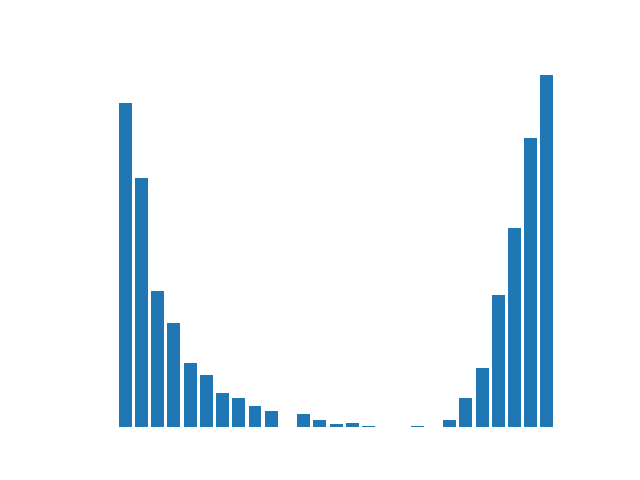
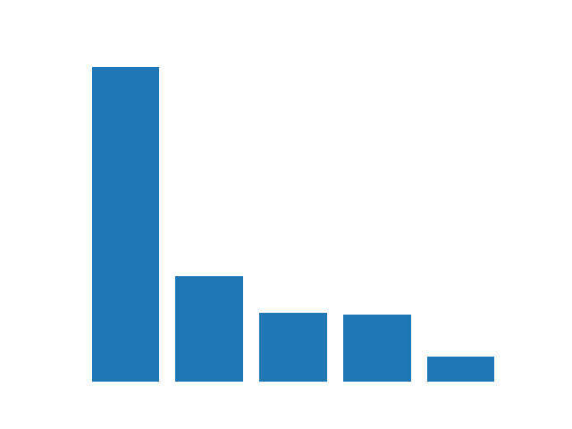
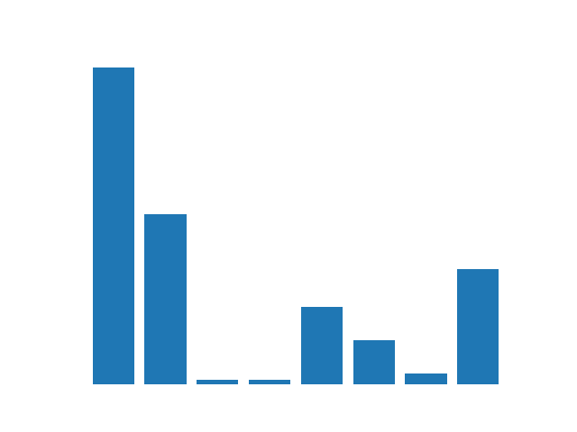
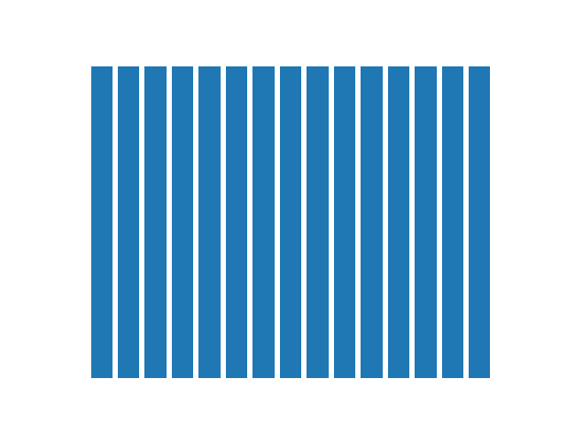
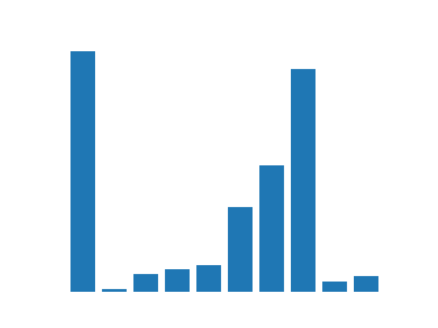

# KEEL Datasets

All datasets have been collected from [KEEL](https://sci2s.ugr.es/keel/index.php). Some of them present missing values (expressed in the column _n_missing_ 
with the number of instances with missing values).

All datasets are in .arff format and separated in 20 files, a train and test set for each one of the iterations of a 10-fold stratified cross validation.

| name | instances | attributes | categorical | numeric | classes | missing | class distribution |
|-----:|------------:|-------------:|--------------:|----------:|----------:|----------:|:------------------:|
| abalone | 4174 | 8 | 1 | 7 | 28 | 0 |  |
| adult | 48842 | 14 | 8 | 6 | 2 | 7.41% |  |
| appendicitis | 106 | 7 | 0 | 7 | 2 | 0 |  |
| australian | 690 | 14 | 6 | 8 | 2 | 0 |  |
| balance | 625 | 4 | 0 | 4 | 3 | 0 |  |
| banana | 5300 | 2 | 0 | 2 | 2 | 0 |  |
| breast | 286 | 9 | 9 | 0 | 2 | 3.15% |  |
| bupa | 345 | 6 | 0 | 6 | 2 | 0 |  |
| car | 1728 | 6 | 6 | 0 | 4 | 0 |  |
| chess | 3196 | 36 | 36 | 0 | 2 | 0 |  |
| cleveland | 303 | 13 | 0 | 13 | 5 | 1.98% |  |
| coil2000 | 9822 | 85 | 0 | 85 | 2 | 0 |  |
| connect-4 | 67557 | 42 | 42 | 0 | 3 | 0 |  |
| contraceptive | 1473 | 9 | 0 | 9 | 3 | 0 |  |
| crx | 690 | 15 | 9 | 6 | 2 | 5.36% |  |
| dermatology | 366 | 34 | 0 | 34 | 6 | 2.19% |  |
| ecoli | 336 | 7 | 0 | 7 | 8 | 0 |  |
| fars | 100968 | 29 | 24 | 5 | 8 | 0 |  |
| flare | 1066 | 11 | 11 | 0 | 6 | 0 |  |
| german | 1000 | 20 | 13 | 7 | 2 | 0 |  |
| glass | 214 | 9 | 0 | 9 | 7 | 0 |  |
| haberman | 306 | 3 | 0 | 3 | 2 | 0 |  |
| hayes-roth | 160 | 4 | 0 | 4 | 3 | 0 |  |
| heart | 270 | 13 | 0 | 13 | 2 | 0 |  |
| ionosphere | 351 | 33 | 0 | 33 | 2 | 0 |  |
| iris | 150 | 4 | 0 | 4 | 3 | 0 |  |
| kddcup | 494020 | 41 | 15 | 26 | 23 | 0 |  |
| led7digit | 500 | 7 | 0 | 7 | 10 | 0 |  |
| letter | 20000 | 16 | 0 | 16 | 26 | 0 |  |
| lymphography | 148 | 18 | 15 | 3 | 4 | 0 |  |
| magic | 19020 | 10 | 0 | 10 | 2 | 0 |  |
| mammographic | 961 | 5 | 0 | 5 | 2 | 13.63% |  |
| monk-2 | 432 | 6 | 0 | 6 | 2 | 0 |  |
| movement_libras | 360 | 90 | 0 | 90 | 15 | 0 |  |
| newthyroid | 215 | 5 | 0 | 5 | 3 | 0 |  |
| optdigits | 5620 | 64 | 0 | 64 | 10 | 0 |  |
| page-blocks | 5472 | 10 | 0 | 10 | 5 | 0 |  |
| penbased | 10992 | 16 | 0 | 16 | 10 | 0 |  |
| phoneme | 5404 | 5 | 0 | 5 | 2 | 0 |  |
| pima | 768 | 8 | 0 | 8 | 2 | 0 |  |
| post-operative | 90 | 8 | 8 | 0 | 3 | 3.33% |  |
| ring | 7400 | 20 | 0 | 20 | 2 | 0 |  |
| saheart | 462 | 9 | 1 | 8 | 2 | 0 |  |
| satimage | 6435 | 36 | 0 | 36 | 7 | 0 |  |
| segment | 2310 | 19 | 0 | 19 | 7 | 0 |  |
| sonar | 208 | 60 | 0 | 60 | 2 | 0 |  |
| spambase | 4597 | 57 | 0 | 57 | 2 | 0 |  |
| spectfheart | 267 | 44 | 0 | 44 | 2 | 0 |  |
| splice | 3190 | 60 | 60 | 0 | 3 | 0 |  |
| tae | 151 | 5 | 0 | 5 | 3 | 0 |  |
| texture | 5500 | 40 | 0 | 40 | 11 | 0 |  |
| thyroid | 7200 | 21 | 0 | 21 | 3 | 0 |  |
| tic-tac-toe | 958 | 9 | 9 | 0 | 2 | 0 |  |
| titanic | 2201 | 3 | 0 | 3 | 2 | 0 |  |
| twonorm | 7400 | 20 | 0 | 20 | 2 | 0 |  |
| vehicle | 846 | 18 | 0 | 18 | 4 | 0 |  |
| vowel | 990 | 13 | 0 | 13 | 11 | 0 |  |
| wdbc | 569 | 30 | 0 | 30 | 2 | 0 |  |
| wine | 178 | 13 | 0 | 13 | 3 | 0 |  |
| winequality-red | 1599 | 11 | 0 | 11 | 11 | 0 |  |
| winequality-white | 4898 | 11 | 0 | 11 | 11 | 0 |  |
| wisconsin | 699 | 9 | 0 | 9 | 2 | 2.29% |  |
| yeast | 1484 | 8 | 0 | 8 | 10 | 0 |  |
| zoo | 101 | 16 | 16 | 0 | 7 | 0 |  |

  
  
  
  
  
  
  
  
  
  
  
  
  
  
  
  
  
  
  
  
  
  
  
  
  
  
  
  
  
  
  
  
  
  
  
  
  
  
  
  
  
  
  
  
  
  
  
  
  
  
  
  
  
  
  
  
  
  
  
  
  
  
  
  
  
  
  
  